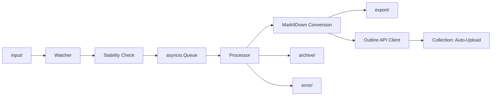

# MarkItDown Outline Auto-Upload Design

**Date:** 2026-05-03

**Goal:** Build a Docker-based ingestion service around MarkItDown that watches an `input` folder, converts supported documents to Markdown, saves the Markdown to an `export` folder, uploads each Markdown file as a new document to the Outline collection `Auto-Upload` on `https://lernen.rohner-dozent.de`, archives successful source files, and moves failed source files into an `error` folder.

## Requirements

### Functional

- Watch an `input` directory continuously for newly added files.
- Detect multiple new files and enqueue all of them for processing.
- Convert each supported file to Markdown using MarkItDown.
- Write Markdown output into an `export` directory.
- Upload every converted Markdown document to Outline as a new document.
- Always create a new Outline document, even when another source file uses the same base filename.
- Move successfully processed source files to an `archive` directory.
- Move source files to an `error` directory if conversion or Outline upload fails.

### Operational

- Run the full workflow inside Docker.
- Keep running after processing completes and wait for more files.
- Avoid processing partially written files.
- Keep configuration outside the codebase through environment variables.
- Provide logs that clearly show the lifecycle and failure reason for each file.

### Security

- Store the Outline API token only in environment variables or Docker secrets.
- Do not commit tokens into source control.
- Because the token was exposed in chat during design, rotate it before production use.

## Chosen Approach

Use a single long-running Python worker process in a Docker container.

The worker will:

- watch the `input` folder
- enqueue stable files into an internal `asyncio.Queue`
- process queued files one at a time by default
- convert files with MarkItDown
- upload Markdown to Outline via the official RPC-style API
- move the source file to `archive` or `error`

This approach was chosen because it gives the cleanest behavior for continuous operation, queueing, error handling, and future extensibility while keeping deployment simple.

## High-Level Architecture



## Runtime Components

### 1. Watcher

Responsibilities:

- monitor `input/` for newly created files
- ignore directories
- avoid duplicate queueing of the same path while it is already pending or processing
- delay queueing until a file is stable

Implementation notes:

- Prefer a filesystem event watcher such as `watchdog`.
- On service start, perform an initial scan of `input/` so files present before container startup are also queued.
- Maintain an in-memory set of `queued_or_processing` file paths to prevent double-enqueue behavior.

### 2. Stability Check

Responsibilities:

- ensure a file is fully written before conversion starts

Implementation notes:

- Check file size and modified time twice with a short delay.
- Only enqueue the file when both values stop changing for the configured stable window.
- If a file disappears during the stability check, log and ignore it.

### 3. Queue

Responsibilities:

- buffer all pending files
- preserve arrival order by default

Implementation notes:

- Use `asyncio.Queue`.
- Default concurrency is `1` to reduce operational complexity and avoid ambiguous ordering.
- Keep concurrency configurable for future throughput scaling.

### 4. Processor

Responsibilities:

- read one queued file
- call MarkItDown conversion
- write the Markdown file
- upload the Markdown to Outline
- move the source file to the final destination
- emit structured logs

Processing contract:

- Success means both conversion and Outline upload succeed.
- Partial success is not enough. If Markdown conversion succeeds but Outline upload fails, the source file still goes to `error/`.
- The generated Markdown file may remain in `export/` even when the upload fails, because it can help with diagnosis and manual recovery.

### 5. Outline Client

Responsibilities:

- resolve the collection ID for `Auto-Upload`
- create a new Outline document for every processed file

Implementation notes:

- On startup, call `POST /api/collections.list` with the collection name query.
- Resolve the collection whose name exactly matches `Auto-Upload`.
- Cache the resulting `collectionId` in memory.
- For each successful conversion, call `POST /api/documents.create`.

## Outline Integration Design

### Base URL

- `OUTLINE_BASE_URL=https://lernen.rohner-dozent.de`

All requests target:

- `POST https://lernen.rohner-dozent.de/api/collections.list`
- `POST https://lernen.rohner-dozent.de/api/documents.create`

### Authentication

Use the HTTP header:

```text
Authorization: Bearer <OUTLINE_API_TOKEN>
```

### Collection Lookup

Startup behavior:

1. Send `collections.list`.
2. Filter by name `Auto-Upload`.
3. Require exactly one matching collection.
4. If no collection is found, fail startup loudly.

Example request body:

```json
{
  "query": "Auto-Upload"
}
```

### Document Create

For each converted file, create a new Outline document with:

- `title`: derived from the source filename without extension
- `text`: Markdown content from MarkItDown
- `collectionId`: cached collection ID
- `publish`: `true`

Example request body:

```json
{
  "title": "example-document",
  "text": "# Converted content\n\n...",
  "collectionId": "<resolved-collection-id>",
  "publish": true
}
```

### Duplicate Handling

- Do not search for existing documents.
- Do not update or replace existing documents.
- Every processed file results in one new Outline document.

## File and Naming Rules

### Input

- The source file remains in `input/` until processing finishes.
- Only regular files are processed.

### Export

- The Markdown file is written to `export/<basename>.md`.
- If that filename already exists, append a timestamp suffix such as `export/<basename>-20260503T223501.md`.

### Archive

- After successful conversion and successful Outline upload, move the original source file to `archive/`.

### Error

- If conversion fails, move the original source file to `error/`.
- If Outline upload fails, move the original source file to `error/`.
- Filename collision rules in `archive/` and `error/` should also use a timestamp suffix instead of overwriting existing files.

## Error Handling

### Conversion Failures

Examples:

- unsupported file type
- corrupted file
- MarkItDown runtime exception

Behavior:

- write an error log with filename and exception details
- move source file to `error/`
- continue processing the next queued item

### Outline Failures

Examples:

- `401` invalid or revoked token
- `403` insufficient permissions
- `404` wrong base URL or API route
- `429` rate limiting
- `5xx` Outline server issues

Behavior:

- log HTTP status and response body
- move source file to `error/`
- continue processing the next queued item

### Startup Failures

Examples:

- missing required environment variables
- collection `Auto-Upload` not found
- Outline authentication fails during startup validation

Behavior:

- fail the container startup clearly
- rely on Docker restart policy after configuration is corrected

## Configuration

Required environment variables:

```env
OUTLINE_BASE_URL=https://lernen.rohner-dozent.de
OUTLINE_API_TOKEN=...
OUTLINE_COLLECTION_NAME=Auto-Upload
```

Optional environment variables:

```env
INPUT_DIR=/data/input
EXPORT_DIR=/data/export
ARCHIVE_DIR=/data/archive
ERROR_DIR=/data/error
FILE_STABLE_SECONDS=3
POLL_INTERVAL=2
WORKER_CONCURRENCY=1
LOG_LEVEL=INFO
```

## Docker Design

### Container Responsibilities

- install MarkItDown with the needed extras
- install the small worker runtime dependencies
- start the watcher/queue processor as the main container process

### Mounted Volumes

- host `input/` -> container `/data/input`
- host `export/` -> container `/data/export`
- host `archive/` -> container `/data/archive`
- host `error/` -> container `/data/error`

### Compose Responsibilities

- define environment variables
- define restart policy
- mount persistent folders

## Logging

Each file should emit a clear trail such as:

- file detected
- file stable
- file queued
- conversion started
- conversion completed
- markdown exported
- Outline upload started
- Outline upload completed
- file archived

On failure, log:

- source filename
- stage that failed
- exception or HTTP status
- final destination path in `error/`

## Test Strategy

### Unit Tests

- filename collision helper
- file stability check
- queue dedupe behavior
- Outline collection resolution logic
- Outline document create payload generation
- path move logic for success and error outcomes

### Integration Tests

- process a supported sample file end-to-end without Outline by mocking HTTP calls
- simulate conversion failure
- simulate Outline upload failure
- simulate startup with missing collection
- simulate multiple files arriving together and verify they are all processed

### Manual Verification

- start the container with mounted local folders
- drop one supported file into `input/`
- verify Markdown appears in `export/`
- verify a new document appears in Outline under `Auto-Upload`
- verify the original file moves to `archive/`
- repeat with several files at once
- repeat with a forced bad token and confirm source files land in `error/`

## Implementation Notes

- Prefer using the MarkItDown Python API instead of shelling out to the CLI from inside the worker.
- Keep Outline API code isolated in its own client module.
- Keep file watching, queueing, conversion, upload, and path handling in separate modules for maintainability.
- Make startup validation explicit so configuration problems fail fast.

## Future Extensions

- optional parallel workers
- retry policy for temporary Outline failures
- webhook or notification on failed uploads
- per-file metadata mapping into Outline document attributes
- support for configurable document title templates

## Assumptions Confirmed During Design

- Upload to Outline happens automatically after each successful conversion.
- Target collection name is `Auto-Upload`.
- Failed files move to `error/`.
- Duplicate source filenames should still create new Outline documents.
- Docker is the required runtime model.

## Out of Scope

- editing or deduplicating existing Outline documents
- multi-collection routing rules
- user interface for monitoring jobs
- distributed queueing across multiple containers
